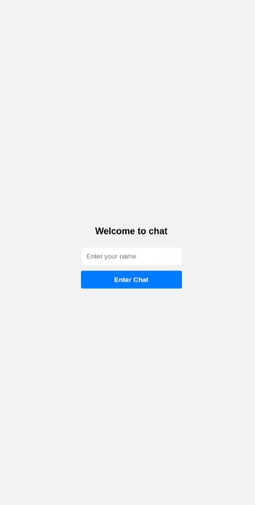

### Exercise Prompt: Real-Time Chat Application

#### Objective:
Create a real-time chat application where users can send and receive messages instantly. The front end should be built with React, and the back end should use Express and Socket.io for real-time communication. Style the application for a pleasant user experience.

#### Requirements:

##### Backend (Express + Socket.io):
1. **Setup an Express Server**:
   - Initialize a Node.js project and set up an Express server.
   - Install and integrate Socket.io.

2. **Handle WebSockets**:
   - Set up WebSocket connections to listen for incoming messages.
   - Broadcast received messages to all connected clients.

##### Frontend (React):
1. **React Setup**:
   - Create a new React application.
   - Install `socket.io-client` for WebSocket communication.

2. **Chat Interface**:
   - Implement a chat window to display messages.
   - Include an input field for typing messages and a send button.

3. **Connect to Backend**:
   - Establish a connection to the Socket.io server.
   - Send messages from the client to the server and display incoming messages in real-time.

##### Styling:
1. **Create a Stylish Layout**:
   - Design a user-friendly interface for the chat application.
   - Use CSS or a CSS framework like Bootstrap for styling.

2. **Responsive Design**:
   - Ensure the chat application is responsive and looks good on various screen sizes.

##### Advanced Features (Optional):
1. **Usernames**:
   - Allow users to set a display name when they join the chat.
   - Display the user's name alongside their messages.

2. **Welcome Message**:
   - Send an automated welcome message to users when they connect.

**Bonus: Message Timestamps**:
   - Show timestamps next to each message.
